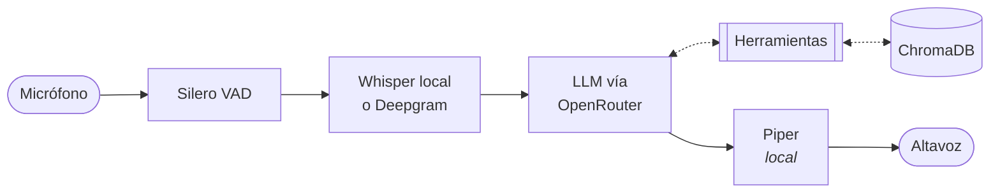

# Agente de voz — NanoPi R4S

Agente conversacional por voz en español sobre una placa de 40 €: escucha por el
micrófono, razona con un LLM, consulta una base de conocimiento propia y
responde hablando. Proyecto **de aprendizaje**, con cada decisión medida y
documentada —incluidas las que salieron mal.



Salvo el LLM, todo corre en la placa: transcripción, síntesis, detección de voz
y base de conocimiento.

## Qué hace

- **Conversa** en español por el micrófono y el altavoz del equipo.
- **Consulta documentos**: subes ficheros desde el navegador —agrupados por
  temas—, los indexas, y los consulta cuando vienen al caso. Si no encuentra nada
  relevante, lo dice en vez de inventárselo.
- **Usa herramientas**: además del RAG, sabe la fecha y la hora reales y lee la
  temperatura, la memoria y la carga de la propia placa.
- **Avisa mientras piensa**: suelta un «déjame consultarlo» pregrabado a los
  82 ms de decidir que va a buscar, en lugar de dejarte en silencio.

## Arranque

Requisitos: NanoPi R4S (o similar aarch64) con Armbian/Debian, un adaptador de
audio USB y una clave de [OpenRouter](https://openrouter.ai/keys).

```bash
sudo apt install -y portaudio19-dev libportaudio2 python3-dev build-essential
sudo cp deploy/asound.conf /etc/asound.conf     # imprescindible, ver docs/audio.md
curl -LsSf https://astral.sh/uv/install.sh | sh

cp .env.example .env && $EDITOR .env            # pon tu OPENROUTER_API_KEY
make install
make audio-check                                # valida el audio ANTES de nada
make models && make ingest
make run
```

Si `make audio-check` falla, para y lee [`docs/audio.md`](docs/audio.md). En esta
placa el audio es la parte delicada.

## Comandos

```
make run              arranca el agente          make lint             ruff + mypy
make audio-check      diagnostica el audio       make test             788 tests
make audio-noise      localiza zumbidos          make build            imagen del agente
make ask Q="..."      consulta el RAG sin voz    make install-service  servicio systemd
make ingest           reindexa corpus/           make service-logs     logs del servicio

make panel            panel web en local         make build-panel      imagen del panel
make panel-export     exporta la configuración   make install-panel    unidades del panel

make botones          el mando físico en local   make botones-sonda    qué gesto ve el mando
make botones-pitidos  afina los pitidos de oído  make install-botones  servicio del mando
```

## Panel de control

Casi todo lo de abajo se puede tocar desde el navegador, sin editar ficheros:
prompt del sistema, personalidad, ajustes, qué herramientas ve el modelo, qué
servidores MCP se conectan, qué hooks se disparan, los temas y documentos de la
base de conocimiento, y el arranque y parada del servicio.

```bash
ssh -L 8080:localhost:8080 nanopi     # y luego http://localhost:8080/panel/
```

Guardar no cambia nada por sí solo: hay que desplegar, lo que exporta la
configuración y reinicia el agente (~20 s). Los documentos van por su propio
camino —subir y reindexar—, y eso el agente sí lo recoge sin reiniciarse. Ver
[`docs/panel.md`](docs/panel.md).

## Mando físico

Los **botones de la tarjeta de sonido** controlan el agente sin túnel SSH y sin
navegador: silenciar el micrófono, mover el volumen, contestar o colgar el
teléfono, y arrancar, parar o reiniciar el servicio. Es la única forma de
gobernarlo **con el agente parado**, que es cuando más falta hace.

```bash
make install-botones
systemctl --user enable --now voice-agent-botones
```

Un clic del botón de audio silencia el micrófono; el rocker de volumen tiene tres
niveles por duración, con un pip al cruzar cada frontera, y lo destructivo pide
confirmación. Todo el feedback es sonoro, porque no hay pantalla. El mapa de
gestos y las trampas del hardware —hay un botón que no emite absolutamente nada—
están en [`docs/botones.md`](docs/botones.md).

## Ajustes

Todo en `.env` ([plantilla comentada](.env.example)), o desde el panel:

| Variable | Para qué |
|---|---|
| `STT_BACKEND` | `whisper` local (gratis, 33 % de error) o `deepgram` (0 % de error, −3 s) |
| `OPENROUTER_MODEL` | Qué LLM. Manda la latencia, no la inteligencia |
| `AUDIO_PROFILE` | `headset` permite interrumpir; `speaker` va en semidúplex |
| `TTS_VOICE` | Voz de Piper: España, México o Argentina |
| `FILLER_DELAY_SECS` | Cuándo suelta un «un momento» si tarda |
| `RAG_MAX_DISTANCE` | Cuán estricto es antes de decir «no lo sé» |

## Rendimiento, sin adornos

Desde que callas hasta que oyes la respuesta:

| | Whisper local | Deepgram |
|---|---|---|
| Latencia total | ≈ 4,8 s | **≈ 2,5 s** |
| Error por palabra | 33,1 % | **0,0 %** |
| Coste | 0 | por minuto |

Con Whisper local **la transcripción se lleva más de la mitad del total**: es el
precio de hacer reconocimiento de voz en una CPU ARM sin acelerador. Las
muletillas no bajan esa cifra, pero evitan el silencio que hace dudar de si te
ha oído.

Todas las cifras están medidas en la placa
([`docs/rendimiento.md`](docs/rendimiento.md)), incluidas tres que contradicen la
intuición: `taskset` sobre los núcleos rápidos **no sirve de nada**, `small` es
catorce veces más lento que `tiny` **sin acertar más**, y lo que degrada la
transcripción no es el tamaño del modelo sino **lo corta que sea la frase**.

## Documentación

| | |
|---|---|
| [`docs/audio.md`](docs/audio.md) | **Empieza aquí.** ALSA, las limitaciones de la tarjeta, el eco, el zumbido |
| [`docs/arquitectura.md`](docs/arquitectura.md) | El pipeline, los frames, y dos trampas de Pipecat 1.x |
| [`docs/rag.md`](docs/rag.md) | Troceado, embeddings, y cómo calibrar el umbral |
| [`docs/herramientas.md`](docs/herramientas.md) | Cómo funcionan y cómo añadir una |
| [`docs/panel.md`](docs/panel.md) | El panel web: prompt, alma, herramientas, MCP, hooks |
| [`docs/telefonia.md`](docs/telefonia.md) | La placa como manos libres del móvil: HFP, PBAP, autocontestar |
| [`docs/botones.md`](docs/botones.md) | El mando físico: los botones de la tarjeta, los gestos, los pitidos |
| [`docs/despliegue.md`](docs/despliegue.md) | Podman rootless, Quadlet, diagnóstico |
| [`docs/rendimiento.md`](docs/rendimiento.md) | Todas las medidas y cómo reproducirlas |

## Limitaciones conocidas

- **Zumbido en los auriculares** mientras el agente corre. Es diafonía del
  adaptador USB —el conversor de entrada inyecta ruido en la salida por la
  alimentación compartida—, no del software: lo que el agente envía a la tarjeta
  en silencio son todas las muestras a cero. No tiene arreglo por software; la
  salida es separar micrófono y auriculares en dos adaptadores.
- **La precisión con voz humana real no está medida.** Todas las pruebas
  automatizadas usan voz sintetizada, que no es un sustituto justo.

## Licencia

Código MIT, pero `piper-tts` es **GPL-3.0** y corre dentro del proceso. Para uso
personal da igual; si lo distribuyes, la GPL puede alcanzar a tu código. La
alternativa es `PiperHttpTTSService`, con un servidor Piper aparte.
