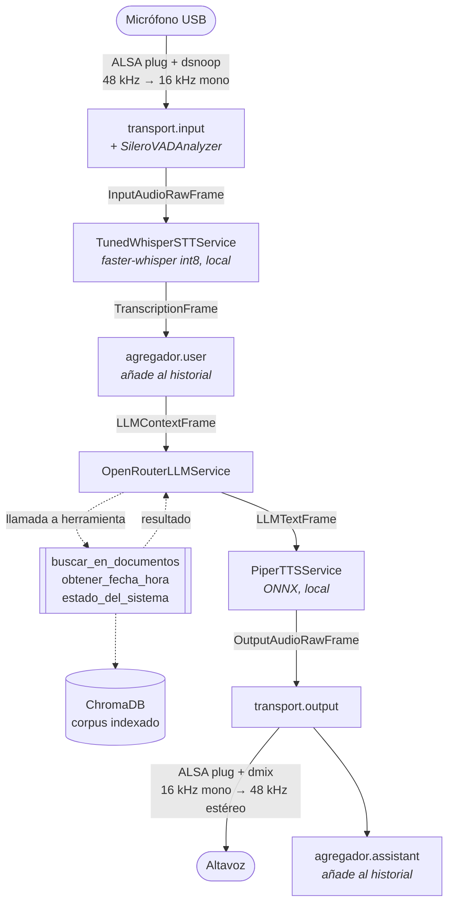

# Arquitectura

## El modelo mental de Pipecat

Pipecat organiza una conversación como una **tubería de procesadores** por la que
circulan *frames*. Un frame es una unidad de información con un tipo: un bloque
de audio de 20 ms (`InputAudioRawFrame`), una transcripción
(`TranscriptionFrame`), un fragmento de texto generado (`LLMTextFrame`), un
evento de "el usuario empezó a hablar" (`UserStartedSpeakingFrame`)...

Cada procesador recibe todos los frames, transforma los que entiende y deja
pasar el resto. Esa es la idea clave: el servicio de síntesis de voz no sabe
nada del reconocimiento de voz, solo sabe que cuando le llega texto produce
audio.

## El pipeline de este agente



En código, `src/voice_agent/bot.py`:

```python
Pipeline(
    [
        transport.input(),  # micrófono; el VAD vive aquí dentro
        stt,  # audio -> texto
        agregador.user(),  # añade lo dicho al historial
        llm,  # historial + herramientas -> respuesta
        tts,  # texto -> audio
        transport.output(),  # altavoz
        agregador.assistant(),  # añade la respuesta al historial
    ]
)
```

### Por qué el agregador de contexto está partido en dos

Es la parte menos evidente del montaje. `LLMContextAggregatorPair` produce dos
procesadores que comparten el mismo objeto de contexto:

- **`agregador.user()`** va justo *antes* del LLM, para que la pregunta ya esté
  en el historial cuando el modelo arranca.
- **`agregador.assistant()`** va **al final del todo**, después de la
  reproducción, y no inmediatamente después del LLM.

Ese "al final" es deliberado. Si la persona interrumpe a mitad de la respuesta,
lo que queda registrado en el historial es lo que realmente llegó a
reproducirse, no lo que el modelo tenía pensado decir. Colocarlo justo tras el
LLM haría que el agente diera por dicho algo que nadie oyó, y a partir de ahí la
conversación se desalinea.

## De dónde sale la configuración

Desde que existe el panel hay más de una fuente, y el orden importa:

```
kwargs explícitos  >  instantánea del panel  >  entorno  >  .env  >  secrets
```

La instantánea (`<DATA_DIR>/config/settings.json`) va **por encima del entorno**
porque la unidad de systemd inyecta el `.env` del proyecto como variables de
entorno reales dentro del contenedor; colocarla por debajo dejaría el panel sin
efecto sobre casi todo. Los kwargs siguen ganando para que los tests puedan
construir un `Settings` explícito sin que se cuele nada del disco.

El prompt, el alma, los hooks y los servidores MCP viajan aparte, en
`runtime.json`, porque son estructuras anidadas que no encajan en variables de
entorno. Sus valores por defecto salen de `prompts.py`, así que un clon sin panel
se comporta exactamente igual que antes de que el panel existiera.

## Dos trampas de Pipecat 1.x que costaron tiempo

Ambas vienen de la reorganización que hubo entre las versiones 0.0.x y 1.x. Si
partes de un ejemplo antiguo, te las encuentras.

### El VAD ya no va en el transporte

En 0.0.x el analizador de actividad de voz se pasaba así:

```python
TransportParams(..., vad_analyzer=SileroVADAnalyzer())  # ← ya NO
```

En 1.x va en el agregador de contexto:

```python
LLMUserAggregatorParams(vad_analyzer=SileroVADAnalyzer(), ...)   # ← sí
```

Lo peligroso no es el cambio, es cómo falla. `TransportParams` es un modelo de
Pydantic que **ignora los campos desconocidos**: pasarle `vad_analyzer=...` no
produce ningún error ni ningún aviso. El agente arranca con toda normalidad,
carga sus modelos, saluda... y no detecta nunca que alguien está hablando.

En este proyecto lo detectó **mypy**, no una prueba ni la ejecución. Es un buen
argumento para tener comprobación de tipos estricta en un proyecto que usa
librerías con configuración basada en Pydantic.

### La estrategia de fin de turno por defecto necesita PyTorch

Explicado más abajo, en "Detección de fin de turno". Si no declaras estrategias
explícitamente, Pipecat intenta cargar `LocalSmartTurnAnalyzerV3` y con él
`torch` y `torchaudio`.

## Decisiones y lo que se descartó

### Reconocimiento de voz: local

Whisper `tiny` con faster-whisper (CTranslate2), cuantizado a int8. Sin coste
por minuto ni dependencia de red más allá del LLM. Cuesta unos 3 segundos por
intervención, que es más de la mitad de la latencia total. La factoría de
`services.py` permite cambiar a Deepgram con una variable de entorno si esa
latencia molesta.

Se usa una subclase, `TunedWhisperSTTService`, porque el servicio que trae
Pipecat no expone el número de hilos ni los parámetros de decodificación. Ver
[rendimiento.md](rendimiento.md).

### Detección de fin de turno: por silencio, no semántica

Aquí hay una trampa. La estrategia **por defecto** de Pipecat 1.6 para decidir
que el usuario ha terminado de hablar es
`TurnAnalyzerUserTurnStopStrategy(LocalSmartTurnAnalyzerV3)`: un modelo que
distingue una pausa para pensar del final real de una frase. Funciona muy bien
y depende de **PyTorch y torchaudio**, que en aarch64 son cerca de un gigabyte
de dependencias y una huella de memoria que no cabe cómodamente en 3.8 GB.

Si no declaras estrategias explícitamente, te lo encuentras al arrancar. Este
proyecto usa `SpeechTimeoutUserTurnStopStrategy`, que cierra el turno tras un
silencio medido con el VAD. Es menos inteligente —te corta si haces una pausa
larga— pero cuesta cero. El umbral se ajusta con `USER_SPEECH_TIMEOUT`.

### Síntesis de voz: Piper, en el proceso

Piper corre dentro del propio proceso mediante ONNX Runtime, sin servidor
aparte. Genera audio 2.6 veces más rápido que el tiempo real.

**Nota de licencia**: el paquete `piper-tts` es **GPL-3.0**. Para un proyecto de
aprendizaje personal da igual, pero si algún día distribuyes esto como producto,
la GPL puede alcanzar a tu código. La alternativa es `PiperHttpTTSService`, que
habla con un servidor Piper instalado por separado y deja la GPL fuera del
ámbito de tu aplicación.

Se descartó **Kokoro** (Apache 2.0, mejor calidad) por ser mucho más lento en
esta CPU.

### Embeddings: fastembed, no sentence-transformers

`sentence-transformers` es la opción habitual, pero arrastra PyTorch. fastembed
ejecuta el mismo modelo (`paraphrase-multilingual-MiniLM-L12-v2`) sobre ONNX
Runtime, que ya está instalado porque lo necesita el VAD. Mismo resultado,
ninguna dependencia nueva pesada.

Se descartó el `all-MiniLM-L6-v2` que ChromaDB trae de serie porque está
entrenado esencialmente en inglés y rinde mal con un corpus en español.

### ChromaDB embebido, no como servicio

`PersistentClient` sobre una carpeta, dentro del mismo proceso. Levantar un
segundo contenedor con su propio servidor HTTP costaría entre 300 y 500 MB para
no ganar nada: solo hay un consumidor. La reindexación se hace lanzando el
comando de ingesta contra el mismo volumen.

### Herramientas: *direct functions*

Pipecat 1.x deduce el esquema JSON de cada herramienta a partir de la **firma
tipada** y del **docstring**. No hay que escribir el esquema a mano ni
mantenerlo sincronizado. La contrapartida es que el docstring pasa a ser código:
editarlo cambia el comportamiento del agente. Ver
[herramientas.md](herramientas.md).

### Inyección de dependencias: `app_resources`

Las herramientas necesitan el buscador del RAG, que es caro de construir. En vez
de variables globales, se usa el mecanismo de Pipecat: se le entrega un objeto
`AppResources` al `PipelineWorker` y llega intacto —por referencia— a cada
llamada dentro de `FunctionCallParams`. Eso hace que las herramientas se puedan
probar aisladamente con dobles, que es justo lo que hace `tests/test_tools.py`.

## Estructura del código

El repositorio es un **workspace de uv con cuatro paquetes** y un único `uv.lock`.
La separación no es cosmética: el panel de control necesita la clase `Settings`
para generar sus formularios, pero si dependiera del paquete del agente
arrastraría Pipecat y chromadb —1,1 GB— a una imagen que existe justamente para
ser pequeña y rápida de reconstruir. `packages/core` es lo que ambos comparten,
y un test comprueba que no engorde.

```
packages/core/src/voice_agent_core/     ligero: solo pydantic y loguru
├── config.py          Settings, la fuente del panel y CAMPOS_PROTEGIDOS
├── prompts.py         instrucciones del sistema, escritas para ser escuchadas
├── runtime.py         prompt, alma, herramientas, MCP y hooks (lo que gobierna el panel)
├── estado.py          lo que el agente publica de vuelta hacia el panel
├── board.py           temperatura, memoria y carga, leídas de /proc y /sys
└── rutas.py           rutas de intercambio y escritura atómica de JSON

packages/panel/src/voice_agent_panel/   Django; ver docs/panel.md

src/voice_agent/
├── __main__.py        punto de entrada; traduce errores a mensajes accionables
├── logging.py         loguru + silenciado del ruido de ALSA/JACK
├── audio_devices.py   resolución de dispositivos por nombre + diagnóstico
├── models.py          descarga anticipada de Whisper, Piper y embeddings
├── services.py        factoría de STT/LLM/TTS/transporte y estrategias de turno
├── prompts.py         instrucciones del sistema, escritas para ser escuchadas
├── resources.py       AppResources: lo que ven las herramientas
├── bot.py             montaje del pipeline y arranque
├── hooks.py           reglas del panel enganchadas a puntos de la conversación
├── mcp.py             servidores MCP externos que aportan más herramientas
├── rag/
│   ├── chunking.py    troceado recursivo por separadores
│   ├── embeddings.py  adaptador fastembed -> ChromaDB
│   ├── store.py       apertura de la colección persistente
│   ├── ingest.py      indexado idempotente del corpus
│   └── retriever.py   búsqueda con filtro por distancia y citas
└── tools/
    ├── knowledge.py   buscar_en_documentos (el RAG)
    ├── clock.py       obtener_fecha_hora
    └── system.py      estado_del_sistema
```
